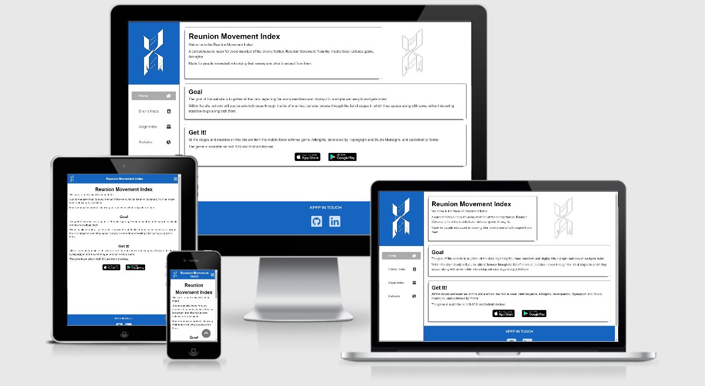
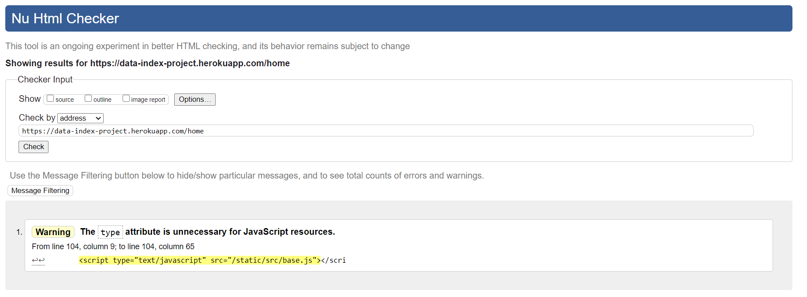
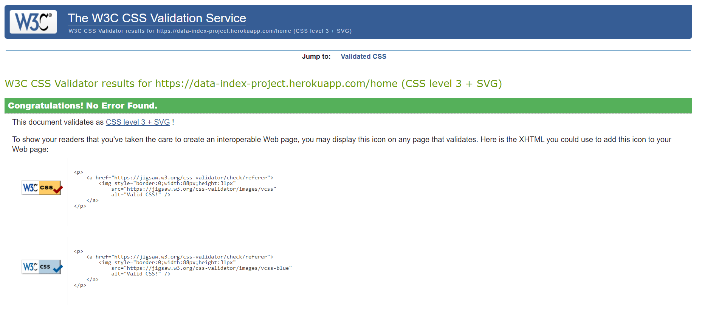

[Live Site](https://data-index-project.herokuapp.com/home)

# Reunion Movement Index

This project is designed to be a simple index and chart project that displays data from a database to the user. The project serves to demonstrate my ability and understanding of Python and data.


## Table of contents:
1. [**Project**](#project)
2. [**UX**](#UX)
    - [**User Stories**](#user-stories)
	- [**Mockup**](#mockup)
3. [**Features**](#features)
    - [**Home Page**](#home_page)
    - [**Enemy Index**](#enemy_index)
    - [**More Info <Enemy>**](#more_info_enemy)
    - [**Stage Index**](#stage_index)
    - [**More Info <Stage>**](#more_info_stage)
    - [**Statistics**](#statistics)
4. [**Technologies**](#technologies)
    - [**Pips and Dependencies**](#pips_and_dependencies)
5. [**Testing**](#testing)
    - [**HTML Validator**](#html-validator)
    - [**CSS Validator**](#css-validator)
    - [**Browsers**](#browsers)
6. [**Deployment**](#deployment)
7. [**Self-Reflection**](#self-reflection)
8. [**Credits**](#credits)
    - [**Icons**](#icons)
    - [**Data**](#data)


## Project

The goal of this site is to display all the encounterable enemies in the mobile game, Arknights, as well as the basic info for each one. 

It should be noted that only the data for permanent and current enemies and stages is displayed. All the data that pertains to enemies and stages that are yet to be released in the global version of the game, or are otherwise only encounterable in time-limited events, are excluded.


## UX

Due to the nature of the data being displayed, the demographic of users would mostly--if not only--consist of Arknights players.

- As an user, I want to see a cohesive list of all the enemies and stages in the game.
- As an user, I want to see more info for each individual enemy and stage.
- As an user, I want to see in which stages a specific enemy shows up, and see all the enemies that appear in a specific stage along the the number of times they appear in said stage.
- As a user, I want to see statistics of the average type of enemy in both the entire game and each individual episode, along with a chart showcasing the number of appearances of each enemy.

### Mockup

A link that takes you to the mockup I made for this project. Note, that the links take you to a PDF file and do not display an image.


## Features

### Home Page: 

A brief info page explaining the project as well as the goal and purpose of it. Here the user is also provided links to the games GooglePlay and AppStore page.

### Enemy Index: 

A simple table displaying data for each enemy along with a portrait of them. 

The user is able to use the search bar to narrow down the list. The list will only filter the list by either the enemies name or code.

The user is able to open up a filter menu which allows them to narrow down the list by either the enemies attack or level type.

On the page, there is also a more info icon that when clicked will take the user to that enemies more info page.

The index is limited to display only ten records from the database at a time with pagination links at the bottom to display another ten.

### More Info <Enemy>:

A page which displays the information for the specific enemy from the Enemy Index in a different formatting along with additional information such as the description of the enemy, and a list showcasing every episode and stage they appear in along with the how many there are in said stage. 

Upon clicking the stage name, the user will be taken to the stages more info page. 

Also, a back button is provided which will take the user back to the Enemy Index.

### Stage Index: 

A simple table displaying data for each stage. 

The user is able to use the search bar to narrow down the list. The list will only filter the list by either the stage name or code.

The user is provided with a select dropdown menu which will filter the list by only showing the stages which are found within the selected episode.

On the page, there is also a more info icon that when clicked will take the user to that stages more info page.

The index is limited to display only ten records from the database at a time with pagination links at the bottom to display another ten.

### More Info <Stage>:

A page which displays the information for the specific stage from the Stage Index in a different formatting along with additional information such as a list of all enemies that can be found in the stage along with the number of times they appear.

Upon clicking the enemy name or portrait, the user will be taken to the enemies more info page. 

Also, a back button is provided which will take the user back to the Stage Index.

### Statistics:

A page displaying statistical data collected from the database.

One pie chart showcasing the average attack type of the enemies, and another showcasing the average level of the enemies.

The user is provided with a select dropdown menu which will filter the pie charts to only showcase data relevant to the selected episode.

Upon filtering the statistics a third chart, a bar chart, will pop below the pie charts showcasing the total enemies which can be found in the selected episode.

The reason as to why the bar chart is not present in the "Show All" option is due to the fact that the page takes too long to load.


## Technologies

The list of technologies and third-party packages used in the making of this project:

- **HTML5:** HTML5: Modern HTML to form the structure of the site.
- **CSS3:** Used to style the site along with Flexbox and Grid.
- **JS:** Used for the logic between HTML elements and interaction between the user and the site.
- **Python3:** Used to create the backend and data-manipulation portion of the project.
- **Git:** Used for version control from the very beginning of the project.
- **Github:** A remote repository used to store the source code for the project.
- **MongoDB:** A NoSQL database program used for creating and storing all the data used in the project.
- **Heroku:** A third-party hosting service used to deploy the live project.
- **VsCode:** Source code editor used to write, edit, test, and debug the source code.

### Pips and dependencies

Along with the technologies listed above, I've also used the following pips and dependencies while making this project:

- **[Flask](https://flask.palletsprojects.com/en/1.1.x/):** A micro web framework written in Python used to loop over the database, create the HTML templates, and append the results from the backend code to the frontend.
- **[PyMongo](https://docs.mongodb.com/drivers/pymongo):** MongoDB's Python driver designed to work with MongoDB from Python.
- **[dnspython](https://www.dnspython.org/):** A DNS toolkit for Python.
- **[py-dotenv](https://pypi.org/project/python-dotenv/):** A pip used to create the virtual environment used in the development of the project.
- **[Flask pagination](https://pythonhosted.org/Flask-paginate/):** A pip used to create the pagination on both the Index pages.
- **[Chart.js](https://www.chartjs.org/):** A dependency used to create both the bar and pie charts on the Statistics page.

For any additional pips or dependencies please refer to either the requirements.txt or package-lock.json file.

## Testing

### HTML Validator

The result of the HTML Validator can be seen in the image below:



### CSS Validator

The result of the CSS Validator can be seen in the image below:



### Browsers

The site has been tested on the following browsers:

- Chrome
- IE
- Edge

Chrome and Edge work as intended without issue.

IE is broken with the table on both the indexes being out of line. The icon on the home page being displaced. And the charts not displaying at all.

## Deployment

The process it took to deploy this project goes as follows:

1. Download and install **[Python](https://www.python.org/)** and **[Node.js](https://nodejs.org/en/)**.
2. Clone the repository
```
git clone https://github.com/Zylashro/data-index-project.git
```
3. Move into the folder
```
cd data-index-project
```
4. After you've done that, make sure Node is installed and run the following to get all the JS dependencies
```
npm install
```
- Install requirements with pip
```
pip install requirements.txt
```
- Create and activate your virtual environment
```
python venv env
```
- Either create a seperate .py file, or in the app.py file add the following code
```python
app.config["MONGO_DBNAME"] = 'ENTER_DBNAME'
app.config["MONGO_URI"] = 'CONNECT_TO_YOUR_DB'
app.secret_key = 'ENTER_SECRET_KEY'
```
- Start the app
```
python app.py
```

## Self-Reflection

During this project I was quite happy and pleased with the end-result. 

The hurdles I have encountered in the previous two milestone projects, have helped me better prepare for this one on almost every facet of development--from scope of the projects, to my expectations, as well as time managements.

My only gripe, and mistake, with this project ended up being the database that I used. In the initial planning of my database, I thought I'd only have minor relational-data which prompted me to go with MongoDB. But that proved to be a mistake as development carried on, I saw that in order to accomplish what I set out to do, I needed a lot of relational data. By the time the realization hit me, it was a bit too late into development to transfer all the data to SQL.

In the end, this project has taught me to be a bit more careful and thorough when designing my databases.

## Credits

The project would not be possible without the following:

### Icons

The icons pulled for this project come from [Font Awesome](https://fontawesome.com/).

### Data

I do not own or claim any right over any of the data, graphics, images used in this project. All rights reserved to the respective copyright owners, Hypergryph, Studio Montagne, and Yostar.